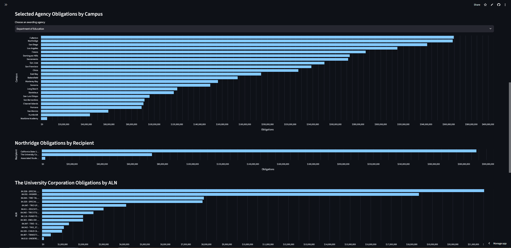

# CSU Grants Dashboard
## Getting Started
- The CSU Grants Dashboard is powered by a public Python library called Streamlit. Streamlit hosts the server, so all you have to do is click [here](https://csugrants.streamlit.app/) to access the dashboard. If the link doesn't work, simply typing csugrants.streamlit.app into your browser should. 
- From here, you should see this screen, or something very similar. 
- If you open to this page instead, fret not for clicking *Yes, get this app back up!* will work to bring you back to the desired page. As Streamlit is a free service, it puts its apps to sleep after 12 hours of inactivity to reserve resources on their end.

## The Sidebar
- The first place you should inspect is the sidebar on the left with two clickable options at the top: _dashboard_ or _ALN Library_. This can be hidden by clicking the two << arrows on the top of the sidebar. 
- The default selected _dashboard_ is the main part of this project, and is outlined below. The _ALN Library_ page can be selected to view a compilation of all ALN present in USAspending's database, organized by their respective agency. In the case of the Department of Health and Human Services, each ALN are organized by HHS Divisions as well.
- As all data on USAspending is self-reported, one should note that some ALN appear more than once, tied to two similar names. One example of this is in the Corporation for National and Community Service's table where we see ALN 94.011 appear twice, tied to FOSTER GRANDPARENT PROGRAM and FOSTER GRANPARENT PROGRAM. Notice the missing D in the second name, and note that misspelled names are a common feature of USAspending's data. 
- With the deconstruction of the Department of Education, or with the passing of time, many ALN will change. If you believe a change should be made to this list, send an email through the link at the bottom of the dashboard's sidebar (more on this later).
- Moving onto the dashboard page of the sidebar, the following sections will outline all navigation and capabilities below the Award Search title.

### Award Type
- The first option to select determines the type of award the dashboard will load. While the dashboard's address is csugrants.streamlit.app, it can indeed load more than just grants. The available awards are grants, contracts, subgrants, and subcontracts. Just click on the dropdown menu to determine which will be loaded.
- Next, you'll decide which campuses you'll want the data loaded for. 
### Recipient Names
- This dashboard pulls all it's data from [USAspending's](https://www.usaspending.gov/search) API. In their database, many recipients of awards are named improperly (such as California Polytechnical University), are outdated, or are named contrary to how you would think they should be named. The naming scheme does not follow any list of recognized names that I have found. 
- To navigate their naming scheme, I have organized award recipients into two categories: Ghost recipients and Active recipients. All Ghost recipients are just recipient names I've deemed inactive, but shouldn't be overlooked. The Ghost recipients can be accessed with the next dropdown menu, but typically won't return many rows of data. The Active recipients are each grouped by the CSU campus they're tied to. If you wish to view data related to all recipients tied to CSU Bakersfield, you can check the box titled *Bakersfield*. If, however, you just wish to inspect data related to a few specific recipients tied to Bakersfield, you can click on the dropdown titled *Bakersfield recipients* to toggle your desired names. It should be noted that clicking the *Bakersfield* toggle will only select all Active names tied to the campus. If you want any Ghost recipients, you can add those with the previously mentioned dropdown. 
- Multiple campuses can be selected at once. You can also select a full campus (such as Bakersfield) and just one recipient name tied to another campus (such as Chico State Enterprises). If you wish to automatically select all Active recipients, you can select the *All CSUs* toggle at the top. All names are alphabetized.
### Loading the Data
- Once you've selected the award type and recipients, you'll find the *No time restriction* toggle at the bottom. This, along with the *Load awards from year* box, determine the earliest action date an award can have in your search. The default is to have no time restriction which ensures the entire USAspending database will be queried. One can also deselect this box to add a date, which will set the earliest action date to January first of that year.
- The *Fetch all matching awards* toggle is selected by default. Deselecting this will allow you to determine how many awards should be loaded, each recipient will then have that many rows loaded. The awards that are loaded are determined by the Prime Award ID (descending) for awards and contracts, ALN (descending) for subgrants, and Awarding Agency (descending) for subcontracts. 
- Both of these restrictions were included for load-time testing in development, but  I've kept them incase they are useful to someone else. 
- Once you've determined all your settings, click the red *Load selected awards* button. This is the only button you can click that will actually ping USAspending with an API pull request, and this will only occur if cache data has been refreshed.
- The *Refresh cache data* button should only be clicked if you believe new awards have shown up in USAspending's database since the last cache data refresh. The first time you load awards after clicking *Refresh cache data*, it will take significantly longer to load as the dashboard will perform API pull requests. If you choose to load data again after this, all rows will have been cached (stored, like taking a screenshot to avoid expensive computations in future runs) and the load time will be significantly decreased. 

## The Data
- Minimizing the sidebar will give you the largest view of the loaded data. 
- At the top of the page, you will see a *Load timing* dropdown. This was another developmental tool I've kept. It shows each recipient name that was selected to be loaded, their UEI, the time it took to load their awards, and the quantity of loaded awards. While hovering over the table, you'll see four icons appear in the top right. The eye allows you to hide certain columns, the download button will download this table as a .csv, the magnifying glass will allow you to search for text (think Control/Command f), and the four corners icon will allow you to expand and minimize the table. Many of these icons appear on the tables throughout this page. 
- The *Total Obligations* and *Total Outlays* numbers represent the sum dollar amount of obligations and outlays from the rows of currently loaded data.
- The *Obligations by Awarding Agency* graph represents how much money each loaded awarding agency is responsible for in obligations across all currently loaded rows of data. As the Department of Education's stabilization fund 84.425 is responsible for a tremendous contribution to the obligations value, I've added a toggle to remove this award. Similarly, as the Department of Education is responsible for far more obligations than most agencies, I've added a toggle to hide all of their contributions. While hovering over this graph, there is a table icon in the top right that will allow you to view the graph as a table. The numbers on the far left are indices representing the recipient names alphabetically. 

- The *Selected Agency Obligations by Campus* graph allows you to select one agency and view the obligations that each CSU campus receives from said agency in your loaded data. I suggest trying this with the grants award type selected, *All CSUs, No time restriction*, and *Fetch all matching awards* selected. The agency with the highest obligations will be selected by default. You can then click on the blue bar corresponding to your campus of interest to view the same obligations and how they're divided amongst the various recipient names tied to your campus of interest. Try it by clicking on Northridge's bar.
- Clicking Northridge's blue bar brings up the Northridge Obligations by Recipient graph. This will display the obligations divided amongst the recipients tied to the Northridge campus. You can now click on one of the recipients' blue bars (try with _The University Corporation_) and it will divide the obligations amongst the ALN tied to each grant that recipient received for the most granular view.

- If loading these obligations graphs for the Department of Health and Human Services, once you select your recipient of the campus, a new graph will appear. This graph, divides obligations amongst HHS divisions, which are also clickable to then view obligations at the ALN level. 
- At the bottom of the page is the rows of data you've selected to be loaded. The formatting is meant to resemble USAspending's table, and is again ordered in the same way as outlined in "Loading the Data." You can add filters to each column by clicking on the three shrinking horizontal bars and typing in the text box. Notice that filters can be changed from the default *Contains* to many other options. This should be especially useful for filtering exact dates, obligation minimums, or ALNs. 

- Once you've filtered the exact rows you want in your table, you can click the *Download results as CSV* right above the table to save your results. Additionally, the first entry of each row acts as a link that can take you to USAspending's page for that specific award if you want further details.

## Suggested Changes
- At the bottom of the dashboard page's sidebar is a link to send an email to Dr. Bethany Johns if you find a bug. 
- This email should also be used if you believe one of the ghost recipients should be brought into the active recipients section, or vice versa. 
- Some ALN data may also be requested to be changed in the ALN Library. 
- As USAspending's database is constantly updating, you may find recipient names present at usaspending.gov that don't appear in our dashboard. This would be another great thing to email, as we can change this as well. 

## Development and Project Layout

- The project is split into a few different Python files to keep the dashboard itself from becoming too difficult to navigate. `dashboard.py` is the main Streamlit page and contains the user interface, sidebar controls, tables, graphs, and other elements the user interacts with.

- `campuses.py` contains the CSU campus information and recipient names used by the dashboard. This includes the Active and Ghost recipient groups discussed earlier in this README. Changes to recipient names, UEIs, campus groupings, or recipient status are made here.

- `load_awards.py` controls the process of loading award data for the recipients selected in the dashboard. For each recipient, it determines whether USAspending should be searched by UEI or recipient name, calls the correct function in `fetch_awards.py`, sends each returned award through `transform_awards.py`, and combines the transformed rows into one Pandas DataFrame. It also adds the campus and loaded-recipient information used later by the dashboard, records load timing information, handles errors between recipients, and controls the per-recipient Streamlit cache. Active recipients with a UEI are searched by UEI, while Ghost recipients and recipients without a UEI are searched by name and have their returned recipient names checked before being included. This is because searching by name will return other names that are spelled similarly. 

- `fetch_awards.py` contains the functions that communicate directly with USAspending. It builds and performs the API searches for prime awards and subawards based on the award type, recipient search value, year restriction, and row limit passed in from `load_awards.py`.

- `transform_awards.py` takes the award objects returned by USAspending and converts them into the consistent row format expected by the rest of the dashboard. This allows grants, contracts, subgrants, and subcontracts to eventually be handled as rows in the same Pandas DataFrame even though USAspending does not return every award type in the same format.

- The `pages` folder contains the separate ALN Library Streamlit page, while `aln_dictionary.csv` contains the ALN information displayed by that page.

The general path of award data through the project is:

`dashboard.py` → `load_awards.py` → `fetch_awards.py` → `transform_awards.py` → `load_awards.py` → `dashboard.py` → user interface

`dashboard.py` first passes the selected recipients and search settings into `load_awards.py`. `load_awards.py` determines how each recipient needs to be searched and passes that information into `fetch_awards.py`. The returned USAspending awards are then sent through `transform_awards.py`, combined into a DataFrame by `load_awards.py`, and returned to `dashboard.py` where the tables, totals, and graphs are created.

A lot of the project's developmental decisions came from working around USAspending's data. Recipient names can change, be misspelled, or remain attached to older awards, which is why the Active and Ghost recipient system exists. Searching Active recipients by UEI also avoids relying on recipient names when a reliable identifier is available. This helps with runtime.

Caching was included because loading many recipients directly from USAspending can require a large number of API requests. Each recipient's results are cached separately, allowing later searches to reuse previously loaded data instead of repeating the same requests. The Refresh cache data button clears this cache when newer USAspending data needs to be pulled.

## Acknowledgements
- Development of this project was assisted by ChatGPT and Claude. 
- Thanks to Dr. Bethany Johns for project guidance and providing ongoing feedback throughout development.

