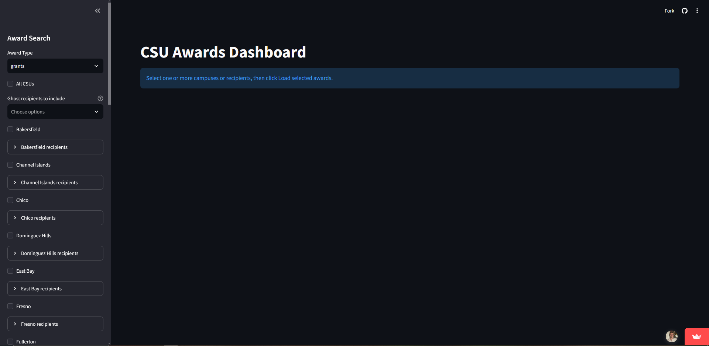
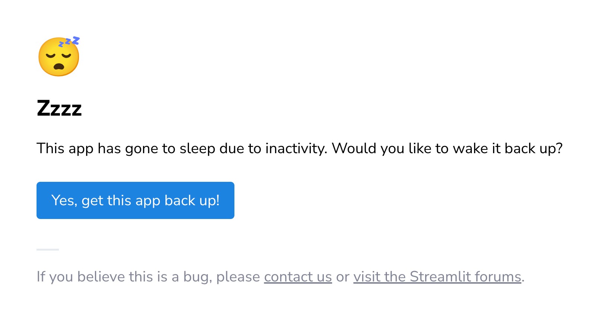
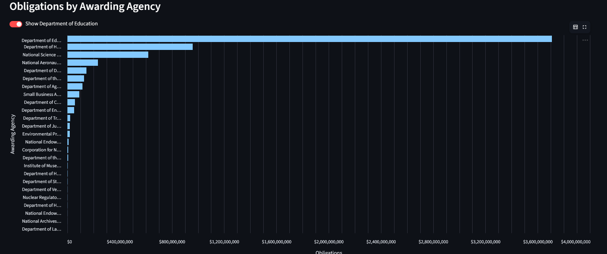
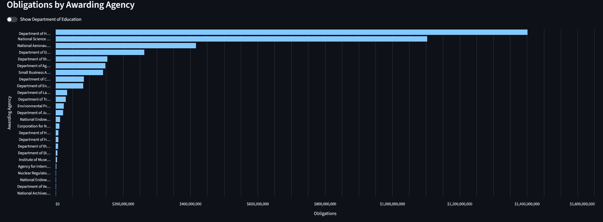
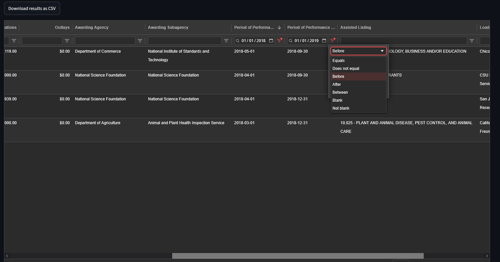

# TODO 
- batching by campus (fix)
- toggle from email
- Editable recipient names list
- aln dictionary
- Update README
# CSU Grants Dashboard
## Getting Started
- The CSU Grants Dashboard is powered by a public Python library called Streamlit. Streamlit hosts the server, so all you have to do is click [here](https://csugrants.streamlit.app/) to access the dashboard. If the link doesn't work, simply typing csugrants.streamlit.app into your browser should. 
- From here, you should see this screen, or something very similar. 
- If you open to this page instead, fret not for clicking *Yes, get this app back up!* will work to bring you back to the desired page. As Streamlit is a free service, it puts its apps to sleep after 12 hours of inactivity to reserve resources on their end.
- 

## The Sidebar
- The first place you should inspect is the sidebar on the left titled *Award Search*. This can be hidden by clicking the two << arrows on the top of the sidebar.
### Award Type
- The first option to select determines the type of award the dashboard will load. While the dashboard's address is csugrants.streamlit.app, it can indeed load more than just grants. The available awards are grants, contracts, subgrants, and subcontracts. Just click on the dropdown menu to determine which will be loaded.
- Next, you'll decide which campuses you'll want the data loaded for. 
### Recipient Names
- This dashboard pulls all it's data from [USAspending's](https://www.usaspending.gov/search) API. In their database, many recipients of awards are named improperly (such as California Polytechnical University), are outdated, or are named contrary to how you would think they should be named. The naming scheme does not follow any list of recognized names that I have found. 
- To navigate their naming scheme, I have organized award recipients into two categories: Ghost recipients and Active recipients. All Ghost recipients are just recipient names I've deemed inactive, but shouldn't be overlooked. The Ghost recipients can be accessed with the next dropdown menu, but typically won't return many rows of data. The Active recipients are each grouped by the CSU campus they're tied to. If you wish to view data related to all recipients tied to CSU Bakersfield, you can check the box titled *Bakersfield*. If, however, you just wish to inspect data related to a few specific recipients tied to Bakersfield, you can click on the dropdown titled *Bakersfield recipients* to toggle your desired names. It should be noted that clicking the *Bakersfield* toggle will only select all Active names tied to the campus. If you want any Ghost recipients, you can add those with the previously mentioned dropdown. 
- Multiple campuses can be selected at once. You can also select a full campus (such as Bakersfield) and just one recipient name tied to another campus (such as Chico State Enterprises). If you wish to automatically select all Active recipients, you can select the *All CSUs* toggle at the top. All names are alphabetized.
### Loading the Data
- Once you've selected the award type and recipients, you'll find the *No time restriction* toggle at the bottom. This, along with the *Load awards from year* box determine how far back in time you will be searching. The default is 2019 which makes all awards whose action date falls within January 1st 2019 to present day (inclusive) will be loaded. *No time restriction* can be selected to load every grant in the USAspending database.
- The *Fetch all matching awards* toggle is selected by default. Deselecting this will allow you to determine how many awards should be loaded, each recipient will then have that many rows loaded. The awards that are loaded are determined by the Prime Award ID (descending) for awards and contracts, ALN (descending) for subgrants, and Awarding Agency (descending) for subcontracts. 
- Both of these restrictions were included for load-time testing in development, but  I've kept them incase they are useful to someone else. 
- Once you've determined all your settings, click the red *Load selected awards* button. This is the only button you can click that will actually ping USAspending with an API pull request, and this will only occur if cache data has been refreshed.
- The *Refresh cache data* button should only be clicked if you believe new awards have shown up in USAspending's database since the last cache data refresh. The first time you load awards after clicking *Refresh cache data*, it will take significantly longer to load as the dashboard will perform API pull requests. If you choose to load data again after this, all rows will have been cached (stored, like taking a screenshot to avoid expensive computations in future runs) and the load time will be significantly decreased. 

## The Data
- Minimizing the sidebar will give you the largest view of the loaded data, although it is unnecessary. 
- At the top of the page, you will see a *Load timing* dropdown. This was another developmental tool I've kept. It shows each recipient name that was selected to be loaded, their UEI, the time it took to load their awards, and the quantity of loaded awards. While hovering over the table, you'll see four icons appear in the top right. The eye allows you to hide certain columns, the download button will download this table as a .csv, the magnifying glass will allow you to search for text (think Control/Command f), and the four corners icon will allow you to expand and minimize the table. Many of these icons appear on the tables on this page. 
- The *Total Obligations* and *Total Outlays* numbers represent the sum dollar amount of obligations and outlays from the rows of currently loaded data.
- The *Obligations by Awarding Agency* graph represents how much money each loaded awarding agency is responsible for in obligations across all currently loaded rows of data. As the Department of Education is responsible for far more than most agencies, I've added a toggle to hide their contributions. While hovering over this graph, there is a table icon in the top left that will allow you to view the graph as a table. The numbers on the far left index the recipient names alphabetically. 

- The *Selected Agency Obligations by Recipient* graph is under development.
- At the bottom of the page is the rows of data you've selected to be loaded. The formatting is meant to resemble USAspending's table, and is again ordered in the same way as outlined in "Loading the Data." You can add filters to each column by clicking on the three shrinking horizontal bars and typing in the text box. Notice that filters can be changed from the default *Contains* to many other options. This should be especially useful for filtering exact dates, obligation minimums, or ALNs. 

- Once you've filtered the exact rows you want in your table, you can click the *Download results as CSV* right above the table to save your results. Additionally, the first entry of each row acts as a link that can take you to USAspending's page for that specific award if you want further details.

## ALN Library
- Under development.

## Acknowledgements
- Development of this project was assisted by ChatGPT and Claude. 
- Thanks to Dr. Bethany Johns for project guidance and providing ongoing feedback throughout development.
